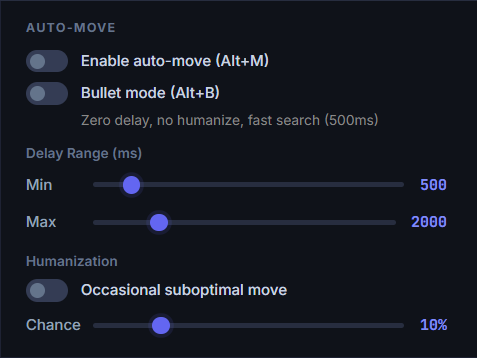
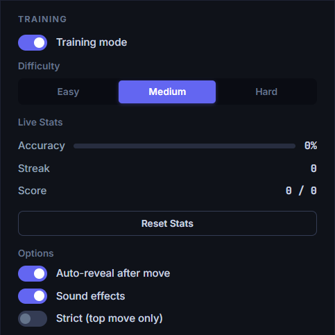
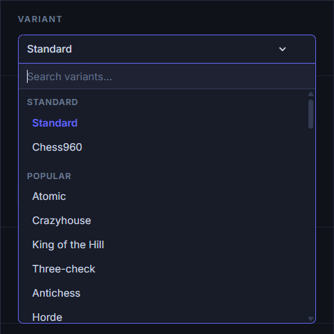
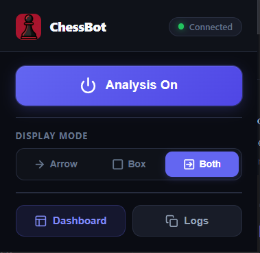

# Chess Analysis Helper

Real-time chess analysis overlay for online chess sites. A Chrome extension reads the board, sends positions to a local Stockfish backend, and draws best-move arrows directly on the board.


## Supported Sites

| Site | Live Games | Puzzles | Variants |
|------|:----------:|:-------:|:--------:|
| [chess.com](https://www.chess.com) | ✅ | ✅ | ✅ |
| [lichess.org](https://lichess.org) | ✅ | ✅ | ✅ |
| [playstrategy.org](https://playstrategy.org) | ✅ | — | ✅ |
| [chesstempo.com](https://chesstempo.com) | ✅ | ✅ | — |

## Features

### Board Analysis


- **Best-move arrows** — green (engine), gold (opening book), blue (Lichess Masters DB); **red arrows** for losing lines
- **Multi-PV** — up to 8 candidate lines with faded secondary arrows, eval badges, depth, nodes/NPS
- **Eval bar & WDL bar** — real-time evaluation alongside the board, plus Win/Draw/Loss percentage bar in the panel
- **Opponent response arrows** — see the likely opponent reply after the best move (pondered ahead automatically)
- **Infinite analysis** — set depth to 0 for unlimited streaming analysis
- **Eval caching** — positions cached in-memory (LRU + TTL) **and persisted to disk across restarts** for instant re-analysis

### Auto-Move (Bot Mode)



- **Automatic move execution** — plays the engine's best move on the board for you
- **Humanization** — configurable random delays (min/max ms) and 0–50% chance of picking a suboptimal move
- **Bullet mode** — zero delay, no humanize, fast 500ms search limit for blitz/bullet
- **Clock-aware time caps** — engine time is automatically capped below your remaining clock so you never flag
- Works on all supported sites via native DOM events

### Tools Panel

A new **Tools** card on the dashboard exposes:

- **Blunder Alerts** — client-side classification of eval drops, with configurable threshold (50–400 cp). Flags ⛔ blunder, ⚠️ mistake, ? inaccuracy in real time.
- **PGN Import / Export** — paste a PGN to scrub through it, or export the current game's eval history as an annotated PGN (`{[%eval N.NN]}`) loadable into chess.com and lichess Study.
- **Eval Cache** — live size / capacity, one-click clear, auto-refreshes every 15s.

### Opening Books & Endgame Tables

- **Multiple Polyglot books** — select one or more `.bin` books simultaneously with merged weight lookups
- **Lichess Masters DB** — query the Lichess opening explorer for master-level moves
- **ECO classification** — opening names shown in the dashboard
- **Syzygy tablebases** — perfect endgame play when ≤7 pieces remain

### Training Mode



- **Progressive 3-stage hints** — piece to move → destination zone → full move reveal
- **Difficulty levels** — Easy, Medium, Hard
- **Accuracy tracking** — correct/total %, streak counter with 🔥 indicator
- **Audio feedback** — optional sound effects for correct/incorrect moves

### 70+ Chess Variants



Automatic engine switching between Stockfish and Fairy-Stockfish based on the selected variant.

| Category | Variants |
|----------|----------|
| **Standard** | Chess, Chess960 |
| **Popular** | Atomic, Crazyhouse, King of the Hill, Three-Check, Five-Check, Antichess, Horde, Racing Kings |
| **Drop** | Crazyhouse, Bughouse, Chessgi, S-House, Loop, Pocket Knight, Shogun, Grandhouse, Placement |
| **Regional** | Makruk, Shatar, Shatranj, Sittuyin, Cambodian Chess, and more |
| **Shogi** | Minishogi, Judkins Shogi, Kyoto Shogi, Tori Shogi, and more |
| **Other** | Ataxx, Breakthrough, Clobber, Los Alamos, Micro Chess, and more |

Drop variants feature full pocket piece detection and drop-move suggestions with animated indicators.

### Dashboard Panel

Built with [Vite](https://vitejs.dev) — bundled, tree-shaken, hash-versioned. Full settings UI at `http://localhost:8080` with a live board preview, drag-reorderable settings cards, and a color picker to customize the accent color across the entire dashboard. All slider values are clickable for direct keyboard input.

**Column 1 — Analysis:** Variant picker, depth (0–30), multi-PV (1–8), analyze for me/opponent/both, time & node limits, FEN display.

**Column 2 — Engine & Training:** Engine selector, threads (1–16), hash (16–1024 MB), skill level (0–20), training mode with stats.

**Column 3 — Display & Automation:** Auto-move with humanization, voice controls, eval bar/PV toggles, display mode, opening books, Syzygy tablebases, **Tools** card (PGN, blunder alerts, cache).

### Extension Popup



Quick-access popup for toggling analysis on/off, checking connection status, switching display modes, and opening the dashboard.

### Voice & Accessibility

- **Text-to-speech** — hear the best move spoken aloud via Web Speech API
- **Configurable speed** — 0.5×–2× speech rate
- **Eval & opening announcements** — optionally speak the evaluation score and opening name

### Hotkeys

| Hotkey | Action |
|--------|--------|
| `Alt+A` | Resume analysis |
| `Alt+S` | Stop analysis |
| `Alt+W` | Analyze for Me |
| `Alt+Q` | Analyze for Opponent |
| `Alt+T` | Toggle Training Mode |
| `Alt+M` | Toggle Auto-Move |
| `Alt+B` | Toggle Bullet Mode |

## Architecture

```
┌───────────────────┐     WebSocket     ┌──────────────────┐
│  Chrome Extension │ ◄──────────────►  │   Node.js Server │
│  (content script) │   ws://localhost  │   (port 8080)    │
│                   │      :8080        │                  │
│ • reads board DOM │                   │ • Stockfish UCI  │
│ • draws arrows    │                   │ • opening book   │
│ • turn detection  │                   │ • ECO database   │
│ • FEN conversion  │                   │ • Syzygy tables  │
└───────────────────┘                   └──────────────────┘
        ▲                                       ▲
        │                                       │
        ▼                                       ▼
┌───────────────────┐                   ┌──────────────────┐
│  Extension Popup  │                   │  Dashboard Panel │
│  (toggle + logs)  │                   │  (Vite, :8080)   │
└───────────────────┘                   └──────────────────┘
```

Built as an npm workspaces monorepo with four packages:

| Package | Purpose |
|---|---|
| `shared/` | TypeScript types + pure helpers (FEN, PGN, multipv, classify, clock, WS message schemas) |
| `backend/` | Express + `ws` server, Stockfish UCI bridge, opening books, Syzygy, persistent eval cache |
| `backend/panel/` | Vite-built dashboard (`@chessbot/panel`) |
| `extension/` | Vite-built Chrome MV3 extension (content script + popup) |

## Quick Start

### 1. Clone & install

Single install at the repo root — npm workspaces handle every package:

```bash
git clone https://github.com/matisseduffield/chessbot.git
cd chessbot
npm install
```

### 2. Download engines

Place engine binaries in the `engine/` directory:

```
engine/
  stockfish/
    stockfish-windows-x86-64-avx2.exe
  fairy-stockfish/
    fairy-stockfish-largeboard_x86-64-bmi2.exe
```

Download from [stockfishchess.org](https://stockfishchess.org/download) and [Fairy-Stockfish releases](https://github.com/fairy-stockfish/Fairy-Stockfish/releases).

### 3. (Optional) Add resources

- **Opening books** — place `.bin` Polyglot books in `books/`
- **Syzygy tablebases** — place `.rtbw`/`.rtbz` files in `syzygy/`

### 4. Build

```bash
npm run build
```

Builds the shared types, the Vite panel bundle, and the Vite-bundled extension in one shot.

### 5. Load the extension

1. Open `chrome://extensions/`
2. Enable **Developer mode**
3. Click **Load unpacked** → select `extension/dist`

### 6. Start the server

```bash
cd backend
node server.js
```

The server auto-serves the built panel from `backend/panel/dist/` when it exists, falling back to the source tree for local hacking.

### 7. Play

Open a game on any supported site. The extension auto-connects and shows best-move arrows. Open `http://localhost:8080` for the full settings dashboard.

## Development

```bash
npm run dev            # backend + panel vite dev server with HMR
npm test               # 393 vitest unit tests
npm run e2e            # Playwright smoke tests against the built panel
npm run typecheck      # tsc on shared + backend
npm run lint           # eslint across all workspaces
npm run format         # prettier write
```

The backend also exposes inspection endpoints useful during development:

| Endpoint | Purpose |
|---|---|
| `GET /healthz` | engine readiness, book/tablebase state, client count |
| `GET /selfcheck` | run a canned 8-ply analysis; verify engine + UCI pipeline |
| `GET /api/cache/stats` | live eval cache size |
| `POST /api/cache/clear` | flush eval cache |

## Configuration

All settings are adjustable at runtime from the dashboard. Environment variables for initial config:

| Variable | Default | Description |
|---|---|---|
| `PORT` | `8080` | Server port |
| `STOCKFISH_PATH` | Auto-detect | Path to Stockfish binary |
| `OPENING_BOOK_PATH` | Auto-detect | Path to Polyglot book |
| `SYZYGY_PATH` | `syzygy/` | Syzygy tablebase directory |
| `ENGINE_DIR` | `engine/` | Engine binary directory |
| `BOOKS_DIR` | `books/` | Opening books directory |
| `SYZYGY_DIR` | `syzygy/` | Tablebases directory |

## Project Structure

```
chessbot/
├── shared/                  # TS: FEN, PGN, clock, WS schemas
├── backend/
│   ├── server.js            # HTTP + WebSocket entrypoint
│   ├── src/                 # engine/, analysis/, book/, ws/, lib/
│   │   ├── analysis/blunder.js
│   │   ├── engine/{evalCache,searchLimits,uciParser,clockCap}.*
│   │   ├── ws/{send,rateLimit,validateMessage}.*
│   │   └── book/{eco,lichess}.js
│   ├── panel/               # @chessbot/panel (Vite dashboard)
│   │   ├── src/             # ES modules (state, board, evalGraph, PVs, ...)
│   │   ├── index.html
│   │   └── vite.config.js
│   └── eco/                 # TSV opening classification files
├── extension/
│   ├── src/
│   │   ├── content/         # Content script modules (13 files)
│   │   └── App.jsx          # Popup UI
│   ├── public/manifest.json # Chrome MV3 manifest
│   └── dist/                # Built extension (load in Chrome)
├── installer/               # Windows Inno Setup script
├── tests/e2e/               # Playwright smoke tests
├── docs/                    # architecture.md, protocol.md, installer.md, ...
├── engine/ books/ syzygy/   # user-supplied, gitignored
└── screenshots/
```

## License

This project is licensed under the [GNU General Public License v3.0](LICENSE.md). See the [LICENSE.md](LICENSE.md) file for details.
